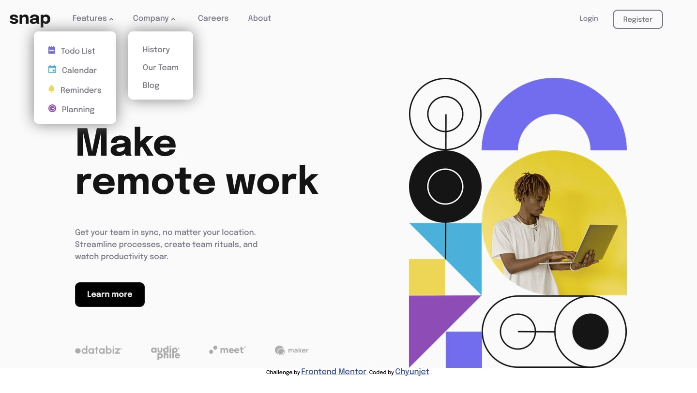

# Frontend Mentor - Intro section with dropdown navigation solution

This is a solution to the [Intro section with dropdown navigation challenge on Frontend Mentor](https://www.frontendmentor.io/challenges/intro-section-with-dropdown-navigation-ryaPetHE5). Frontend Mentor challenges help you improve your coding skills by building realistic projects. 

## Table of contents

- [Overview](#overview)
  - [The challenge](#the-challenge)
  - [Screenshot](#screenshot)
  - [Links](#links)
- [My process](#my-process)
  - [Built with](#built-with)
  - [What I learned](#what-i-learned)
  - [Continued development](#continued-development)
  - [Useful resources](#useful-resources)
- [Author](#author)
- [Acknowledgments](#acknowledgments)

**Note: Delete this note and update the table of contents based on what sections you keep.**

## Overview

### The challenge

Users should be able to:

- View the relevant dropdown menus on desktop and mobile when interacting with the navigation links
- View the optimal layout for the content depending on their device's screen size
- See hover states for all interactive elements on the page

### Screenshot



### Links

- Solution URL: [Add solution URL here](https://your-solution-url.com)
- Live Site URL: [Add live site URL here](https://your-live-site-url.com)

## My process

### Built with

- Semantic HTML5 markup
- CSS custom properties
- Flexbox
- Mobile-first workflow
- box shadow
- div with grey background and opacity for greyed website effect
- learned more VS CODE shortcuts


### What I learned

(Use this section to recap over some of your major learnings while working through this project. Writing these out and providing code samples of areas you want to highlight is a great way to reinforce your own knowledge.)

- I learned on how to greyed out a website, by using an abosute positioned div with bg color and opacity
- I reinforced my JS skill on onclick function, if statement and create variable with get element by ID and class
- First time using CSS custom properties to improve the readability of my code.


To see how you can add code snippets, see below:

```html
<div class="greyed"></div>
```
```css
.greyed{
display:none;
width:120px;
height:750px;
position: absolute;
background-color: hsl(0, 0%, 8%);
opacity: 0.7;
}
:root{
--font_normal:500;
--font_heavy:700;
--Almost_White: hsl(0, 0%, 98%);
--Medium_Gray: hsl(0, 0%, 41%);
--Almost_Black: hsl(0, 0%, 8%);
--h1_font_size:2.2rem;
--body_font_size:1rem;
--smaller_body_font_size:0.90rem;
--desktop_container_width:1000px;
--desktop_h1_font_size:4.8rem;
--mobile_width:375px;
}


### Continued development

-I would like to learn a faster way to code since it tooks me more than 6 hours to finish this.
-I would like to learn more on responsive website, so that my image and text will be more responsive as the width getting bigger


(Use this section to outline areas that you want to continue focusing on in future projects. These could be concepts you're still not completely comfortable with or techniques you found useful that you want to refine and perfect.)


### Useful resources

- (https://www.w3schools.com/cssref/css3_pr_box-shadow.asp) - Remind me on what to do with box shadow
- (https://www.youtube.com/watch?v=PHO6TBq_auI) - Learned CSS Custom Properties in this video
- (https://www.youtube.com/watch?v=9M58urr1CVQ) - Learned VS code shortcut from here.

(Note: Delete this note and replace the list above with resources that helped you during the challenge. These could come in handy for anyone viewing your solution or for yourself when you look back on this project in the future.)

## Author

- Frontend Mentor - [@Jetyun](https://www.frontendmentor.io/profile/Jetyun)


## Acknowledgments

Thank you Dave Gray for teaching JS CSS and HTML to me, and thanks Fireship and Kevin Powell on more advanced technique on web dev.

**Note: Delete this note and edit this section's content as necessary. If you completed this challenge by yourself, feel free to delete this section entirely.**
